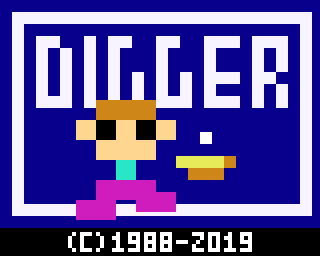
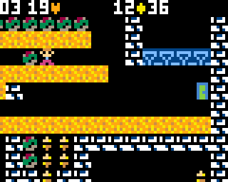
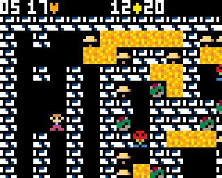
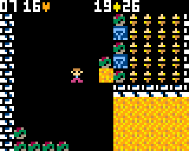
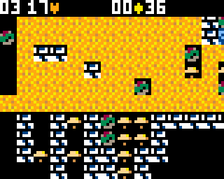
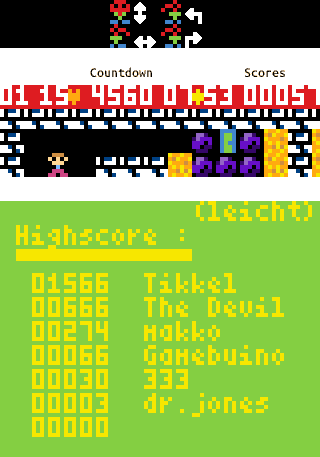

# DiggerKC85
## Port of an old <a href="http://lanale.de/">KC85-game</a> for <a href="https://gamebuino.com/gamebuino-meta">Gamebuino-META</a> 
(fork from the orig. programmed <a href="https://github.com/scmar/DiggerMETA">scmar/DiggerMETA</a>)
  

  

 

  

 
  
 
See <a href="https://gamebuino.com/creations/wip-diggermeta">Gamebuino forum thread</a>
